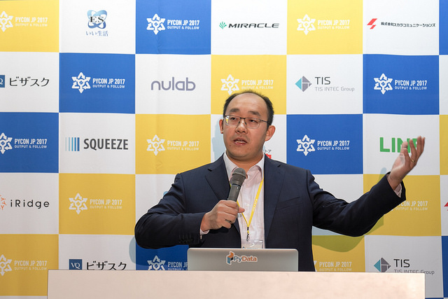

# PyCon JPとは

PyCon JPは，Pythonユーザが集まり，PythonやPythonを使ったソフトウェアについての情報を交換し，Pythonユーザが交流をするためのカンファレンスです。

PyCon JP 2017は2018年9月7日〜10日に早稲田大学西早稲田キャンパスで行われ、メインイベントとなる9月8日〜9日のカンファレンス来場者は約700人と大盛況でした。(9月10日のスプリントのみMicrosoft社で実施)
ご参加いただいた皆様，本当にありがとうございました。

ここでは2日間のカンファレンスのなかから、選りすぐりの注目セッションをレポートしていきます。

# 1日目基調講演「Python for Data: Past, Present, and Future」 ― Peter Wang

## Peter Wangさんの紹介

カンファレンス1日目の基調講演は、昨今非常に注目を浴びてきている「Python」と「Data」を題材にしたPeter Wang氏による講演でした。
Peter氏は、Numpy、Scipyの開発者であるTravis Oliphant氏とともにContinuum Analyticsを設立し、データサイエンス向けディストリビューションであるAnacondaを開発やPyDataカンファレンス、PyDataコミュニティを立ち上げてきた方です。

この講演は、Peter氏の自己紹介とともにContinuum Analyticsを設立した2012年から現在までのPythonやデータサイエンスをとりまく環境とその変化を振り返りながら始まりました。
2012年時点ではビッグデータに関するカンファレンスでもHadoopやJavaを利用したセッションが多かったようですが、現在ではPythonは[CM]()にまで登場するほどポピュラーな言語になっているとユーモアを交えて紹介されました。

さて、5年前とは打って変わって非常にポピュラーになったPythonですが、なぜデータサイエンス分野でPythonを使うべきなのでしょうか。
Peter氏が示したのは下記の2点でした。

* Pythonは教育用プログラミング言語であるABCをルーツとしているため、教育やプロトタイピングに向いている
* Pythonはソフトウェア開発からデータ分析まで広い領域をカバーしている

また、Peter氏は「Data science != Software Development」とも話していましたが
実際にPyCon JP 2017の参加者の中にもソフトウェア開発よりデータ分析がメインという方も多いようでした。
これは他のプログラミング言語のカンファレンスではあまりみないPythonの特徴のひとつですね。

Peter氏からは「What's Next?」と題したPythonの将来についての話もありました。
Peter氏は、「Apache Arrow formatにより言語間での相互運用性が高まる」、「メモリやストレージ、GPUの改善によってより多くのことがローカル環境で実行できるようになる」などの予測をしていました。

そして、講演の最後では、Pythonに関連するコミュニティについて言及し、その特徴を「Huge Maker Community」と表現しました。
これは、ScipyのようなPythonのメジャーで巨大なライブラリ群がソフトウェア開発者ではなく、ユーザー自身の手で作られていることを表した言葉ですが、端的にその特徴を捉えていると非常に感心させられました。

講演後には質疑応答がありましたが、こちらも活発に質問が飛び交いとても盛り上がりました。
キーノートの様子は質疑応答も含めて[こちら]()で動画配信していますので、ぜひご覧ください。

## 参考

* [動画](https://www.youtube.com/watch?v=IaTDjOClhNA)
* [スライド](https://www.slideshare.net/misterwang/python-for-data-past-present-future-pycon-jp-2017-keynote)

