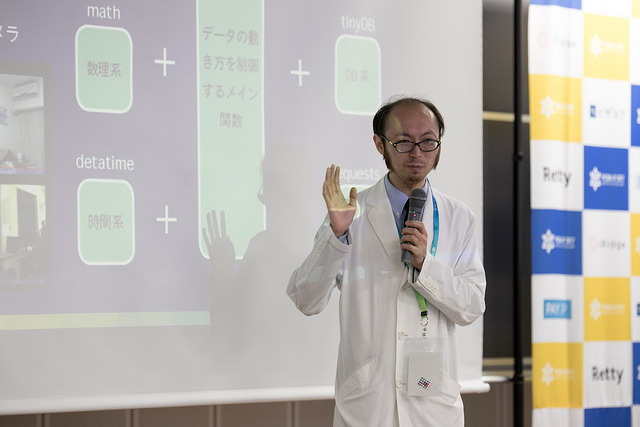
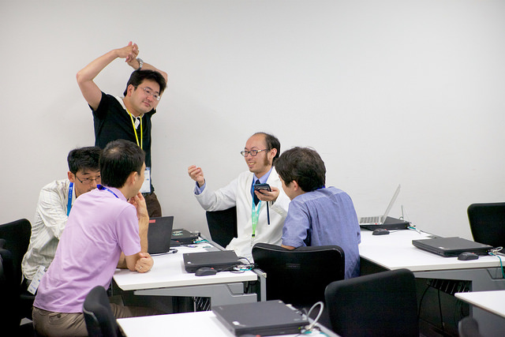
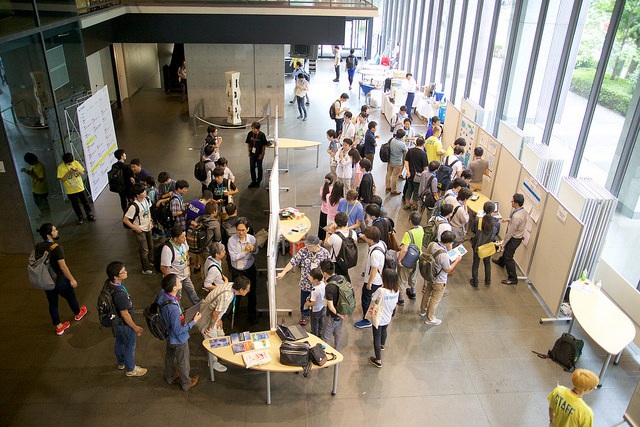
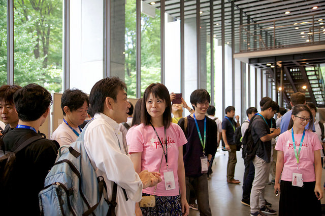
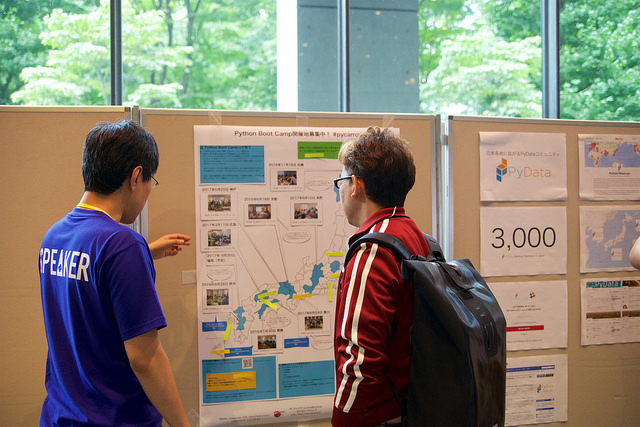
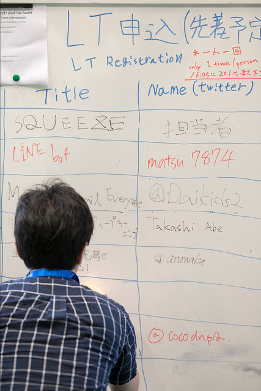
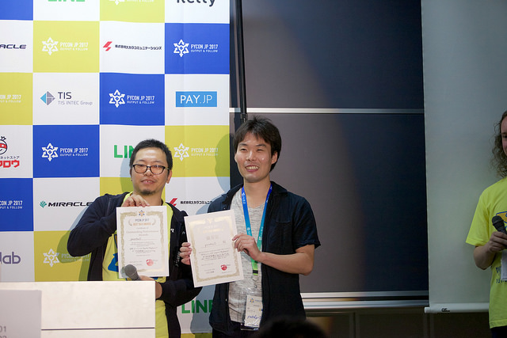

皆様、こんにちは。PyCon JP メディアチームです。先日公開した[カンファレンス1日目の記事]()はいかがでしたでしょうか？
本レポートでは引き続き２日目の基調講演やカンファレンスなどの様子をご紹介します。
Youtubeへのリンクもありますので、ぜひご自宅や職場でカンファレンスの様子をご覧ください。

# 2日目基調講演「pandasでのOSS活動 事例と最初の一歩」 ― Masaaki Horikoshi
(小林 正彦)

2日目の基調講演は、Masaaki Horikoshi氏による「pandasでのOSS活動事例と最初の一歩」です。
Horikoshi氏はPythonでデータ分析を行う際のパッケージとして有名なpandas、ならびに並列・分散処理するパッケージであるDaskのコア開発メンバーをつとめています。
また、自身でもPython, R, Rustでデータ分析のためのパッケージ開発を行っています。


講演では、科学計算分野におけるPythonの現状の紹介から始まり、自身がコア開発メンバーとして参加されているpandasのOSS活動の詳細、そしてこれからOSS活動をしていくために大事なことについて話していただきました。

そして、このプレゼンを通して、OSS活動に参加する際のハードルを下げられればとおっしゃっていました。

## 科学計算分野のPython
まず、汎用的なプラグラミン言語であるPythonが科学計算分野でよく使われる3つの理由を紹介しています。

* 教育機関で使われている
* C/Fortranで書かれた資産の利用が容易である
* 科学計算系のOSSが発展・成熟してきている

現在は、OSSの成熟が進むことにより教育機関で使われることが多くなり、その結果OSSの成熟度が増していくといった良いサイクルができているということでした。

また、科学計算用のパッケージとして有名な「NumPy, SciPy, pandas, scikit-learn, matplotlib, jupyter」などの他にもタスクに応じて数多くのパッケージがあり、それらはPythonのエコシステムを生かして、チームでの開発体制が整っている点も良い特徴として挙げられていました。

さらには、国内外で様々な科学計算系のコミュニティ・イベントが活発化してきているそうです。
Python全般および科学計算系のイベントとしてはPyConをはじめ、PyData, SciPyが有名です。
データ系イベントの本家とも言えるSciPyの2017カンファレンスは９日間という長期間にわたり開催されました。
データ系という分野だけでこの期間を実施できるということからも、年々、科学計算分野に対する関心が高まっていることを示しています。

## pandsでのOSS活動事例の紹介
次に、Horikoshi氏がpandsのコミッタになるまでの経緯や、コミッタとしての具体的な活動内容を紹介していただきました。

はじめてissueを投げたのが2012年後半で、Pull Requestを送信しはじめたのが2014年前半のこと。それから1年ほどしてコアチームに選出されたそうです。
pandasのコアチームメンバーに選出されるには、質・量においてともに高い貢献度のある活動をしていることと、活動期間（１年以上）の実績が評価され、コアチームメンバの推薦・投票をもって決定となります。それからは、issueへの回答、コードレビューといったコミッタの役割をこなしているとのことです。プロジェクトのスコープを決めることも役割の一つ、ということでした。

「重要なことは、プロダクト・コミュニティの品質を維持するための仕組みをつくること。」とおっしゃっていました。

例えば、プロダクトの品質である「使いやすさ、バグの少なさなど」を担保するための取り組みの一つとして、PyPiに対して様々なバージョンのwheelを提供したりしているそうです。
また、pandasの場合はパフォーマンスの性能が重要になってくるので、コミット前後でパフォーマンスがデグレしていないかなどもチェックしているとのことでした。

コミュニティの品質としては「オープンであること、参加しやすくサポーティブであること」は重要です。
オープンなコミュニケーションの例として、極力Github上でやりとりをし、メーリングリストの中で開発のディスカッションはしないようにしているそうです。
また、行動規範やドキュメントを整備して、はじめての方が入りやすいように配慮しています。

pandasの開発プロセスはいきなりできあがったわけではなく、多くのエンジニア(800人程)が関わってきた結果として今があるということでした。


## OSS活動　最初の一歩
そして、講演の最後では、「これからOSS活動をはじめるための最初の一歩」というテーマについて詳しく教えていただきました。

まず、「OSS活動はコードの修正だけではない。」ということをおっしゃっていました。
宣伝活動や、ノウハウの共有、バグのレポートなどもOSS活動の一つだそうです。

最終的には、コード修正をしてPull Requestをすることになりますが、最初からそこを目指さずに、
まず最初に「１つのプロジェクト/１つの機能」を対象として範囲を狭めて活動していくことを勧められていました。
「ドキュメントの改定」といった比較的簡単なものでも喜ばれるそうです。

Pull Requestを送付するためにまずはissueを探します。issueにつけられたタグを見て、難易度、分野を確認してみましょう。
もし直したいissueが見つからない場合は自分で書いたほうがいいとのことです。
issueを書くことで該当箇所の修正が受け入れられるかどうかを事前に確認できます。
また、issueを起こすことで有識者からアドバイスをもらることもあります。
まずは、直す意思を示すことが重要とのことでした。

Pull Requestを送付する際にハードルに感じる要因として、英語力、Gitの使い方、そもそものPythonの技術力などがあると思いますが、
それらはあまりきにする必要はないとのことでした。仮に問題があったとしても教えてくれるので、とりあえず送ることが大事。
最低限のルールを守れていれば臆することはない、とのことです。

まず、今日からきになるプロジェクトをwatchしてみましょう。

講演後には質疑応答がありましたが、こちらも活発に質問が飛び交いとても盛り上がりました。
基調講演の様子は質疑応答も含めて[こちら](https://www.youtube.com/watch?v=1Cb3OQTmeD4&list=WL&index=2)で動画配信していますので、ぜひご覧ください。

### 資料リンク

* [動画](https://www.youtube.com/watch?v=1Cb3OQTmeD4&list=WL&index=2)
* [スライド](https://speakerdeck.com/sinhrks/pandasdefalseosshuo-dong-shi-li-tozui-chu-false-bu)


# 2日目注目セッション「理論から学ぶPythonによるサーバレス開発」 -  Masashi Terui
(小林 正彦)

昨今、注目を集めるServerlessについて、AWS Lambdaと関連サービスを例として、その考え方やFaaSの動作原理に触れながら特性を踏まえた設計・実装方法についてMasashi Terui氏にご紹介していただきました。

実装のポイントなど、多くの内容の中から一部抜粋してご紹介したいと思います。
すべてをご紹介することができず残念ですが、詳細はレポート末尾の参考欄に資料と動画へのリンクを載せているのでそちらをご確認ください。


## Serverlessとは何か
一般的には「管理するサーバが「ない」、OSが「ない」、常駐プロセスが「ない」ことによって煩雑な管理業務から解放される」というような説明を聞くことが多いですが、これではServerlessの使い途が見えづらくなってしまうので、「ない」ものを語るのではなくSererlessだからこそ「ある」ものに目を向けることが重要とのことです。

具体的に「ある」ものは以下の2つです。
* Functions as a Service(FaaS)
* Functional SaaS

FaaSは、関数単体で独立した環境とそのリソースのことです。
プロトコルレイヤーまで隠蔽する高い抽象度と、それによってInput/Outputに注力した実装ができる点が特徴です。

Functional SaaSは、単独ではサービスとして完結しない点が従来のSaaSとは異なります。
Fully managedな環境であることを前提として、特定の機能を提供するSaaSのことを言います。

この２つを組合せる、つまり「Functional SaaSをFaaSで繋いで実装したもの」がServerlessと言えます。

## 仕組みについて
FaaSの実体はコンテナです。OSSのFasS実装の多くはバックエンドにDockerを使用しています。
特定のイベントを受けて、コンテナを起動して関数を実行していきますが、コンテナの起動やPythonプロセスを稼働させることにもオーバーヘッドが生じることは意識した方が良いでしょう。（VMよりはるかに小さいとは言いえ）
また、１つのイベントに対して複数の関数を実行できるので、並列・非同期処理に向いているのが特徴です。

FaaSとは「あらゆる操作をイベントとして扱い、Pull型のPub/Subモデルで、オンデマンドにコンテナ内で実行される関数」と言えます。

## Serverlessに向いているシステム
一例として、IoTは非常に相性がいいそうです。
計測データをhttpsで受け取って集約・計算し、外部サービスに連携させていくようなシステムもその一つであり、処理のステップ毎に関数の起動数を調整することができる特徴が活かせます。

逆に、一般的なWebAPIアプリケーションシステムはServerlessに向いていないともおっしゃっていました。
何故かと言うと、リクエストとレスポンスが一対一で同期的であるため、Serverlessのアーキテクチャにマッチしないということです。
ただし、Serverlessにすることで運用面で得られるメリットもあるので実装してはいけないということではありません。

## 実装のポイント
[The Twelve-Factor App](https://12factor.net/ja/)という基本的な開発手法は、Serverlessの実装においても参考になります。

他には、コンテナがオンデマンドに起動・破棄されるという仕組み上、
* RDBとの相性はイマイチ
* Cold start時の遅延を抑えるように実装する
* インスタンスをキャッシュしておく
などが挙げられます。
また、イベントの配信は「at least once」という性質を持っているために関数は冪等性を持つ必要がありますが、
「冪等」＝「正常系を何回実行しても同じ状態になるようにしないといけない」というわけではありません。
どのイベントを適応したかを覚えておいて、二回目は無視するという仕組みも、冪等性を担保していると言えます。

最後に、SaaSを選ぶ際は、APIの充実度は選ぶポイントになります。設定情報をAPIで抜き出してテキスト管理する、必要であれば同じ設定で実装できるというのは重要なポイントです。

ここでは紹介しきれなかった内容は以下のリンクからご確認ください。

### 資料リンク

* [動画](https://www.youtube.com/watch?v=ZE1CsOUZSDg)
* [スライド](https://slideship.com/users/@marcy-terui/presentations/2017/09/9PzXZzcJfBR1ENEMmMbGSf/?p=2)


# 2日目注目セッション「Pythonの本気！RaspberryPiやEdisonを使ったIoTシステムの構築」 - Yuta Kitagami
(山口 祐子)

みなさん興味津々のIoTネタということで、Yuta Kitagami氏による講演をご紹介します。Kitagami氏は高校時代からハードウェアに手を出し、現在はハードウェアとソフトウェアの両方の知識を生かしご活躍されています。最近では[Intel Edisonマスターブック](http://gihyo.jp/book/2017/978-4-7741-8921-5)という本を出版されました。  

Kitagami氏がIoTに精通しているということで、おそらく会場の皆さんは「IoTでこんなことができました」系のトークを期待されていたと思います。しかしKitagami氏は「できました系の話はつまらない。私はなぜそれができたかの話をします」というかっこいい発言で会場を沸かせていました。  



「IoT時代においてPythonは最強」という主張をしたKitagami氏。Pythonはハードウェアが扱えるということがその理由だそうです。  

ではなぜPythonはハードウェアが扱えるのか？Pythonにはハードウェアのライブラリがあるというのがその理由ですが、そのライブラリはC言語のラッパーとして作成されています。C言語では例えばレジスタへアクセスできるため、GPIOなどのハードウェアを動かすという芸当ができるということなのです。  

そうなると、IoT領域においては低レイヤーのC言語がベストなのではという疑問が当然出てきます。それに対してKitagami氏は、「そんなC言語をラップできるPythonこそ最強」と答えます。つまり、低レイヤーにアクセスできるC言語に、多様なライブラリを要するPythonが合わさることで、実に様々なことが実現できるのです。例えば温湿度センサーの機能を使ってデータを取得しそれをDBに格納、サーバでデータを表示、そしてネットワークにも繋げるということも可能です。  

```
<iframe src="//www.slideshare.net/slideshow/embed_code/key/noOWzVT0B9dlgZ?startSlide=26" width="595" height="485" frameborder="0" marginwidth="0" marginheight="0" scrolling="no" style="border:1px solid #CCC; border-width:1px; margin-bottom:5px; max-width: 100%;" allowfullscreen> </iframe> <div style="margin-bottom:5px"> <strong> <a href="//www.slideshare.net/yutakitagami/pycon-jp-2017yuta-kitagami" title="PyCon JP 2017Yuta Kitagami" target="_blank">PyCon JP 2017Yuta Kitagami</a> </strong> from <strong><a href="//www.slideshare.net/yutakitagami" target="_blank">Yuta Kitagami</a></strong> </div>  
```

トークでは、Kitagami氏自作の自宅の温湿度モニタリングシステムを披露していました。  

軽快なトークで会場を沸かせたKitagami氏。講演の時間だけでは足りず、終了後も場所を変えて参加者とIoT話に花を咲かせていたようです。  



### 資料リンク

* [動画](https://www.youtube.com/watch?v=EQtcsJq-l98)
* [スライド](https://www.slideshare.net/yutakitagami/pycon-jp-2017yuta-kitagami/1)
* [トゥギャッターまとめ](https://togetter.com/li/1148920)


# 2日目注目セッション「SREエンジニアがJupyter＋BigQueryでデータ分析基盤をDev＆Opsする話」 - yuzutas0
(山口 祐子)

株式会社リクルートテクノロジーズでグループのIT施策全般を担当されているyuzutas0氏の講演を紹介します。プロダクト開発におけるデータ活用の一事例として、組織が抱えていた問題、そしてそれを解決するための取り組みをお話くださいました。  


yuzutas0氏が担当されているゼクシィ縁結びやゼクシィ恋結びでは事業が拡大しており、各部署にステークホルダーが多く存在していました。yuzutas0氏のチームではステークホルダーへ多種多様なデータを提供しており、それらのデータを活用するためにはデータ自動化・可視化が不可欠と感じていました。というのは、各部署によって必要なデータ、データ形式、データ疎通環境が異なるという混沌とした状況になっており、それに伴い調査コストなどのエンジニアチームの負荷が増加していたからです。  

そういった事情からデータ基盤システムを作ることになりましたが、設計にあたって2つのことを意識したそうです。  
一つ目は「ModelとViewを分ける」こと。部署や職種によって必要とされるViewは異なります。Excel,Tableau,Re:dash,Jupyterなど、多様なViewに対応できるようにしています。  

```
<script async class="speakerdeck-embed" data-slide="56" data-id="d520b273412b44bbb1b503e5a3ce83d5" data-ratio="1.77777777777778" src="//speakerdeck.com/assets/embed.js"></script>  
```

二つ目は「なるべくラクしてつくる」こと。世の中には便利なツールが多くあり、全て自分たちで作る必要はありません。アプリ層においては「Python」を採用しました。汎用的なプログラム処理を書くことができたり、データ分析関連のライブラリやツールが充実していたことがその理由です。また、インフラ（データ保存）に関してはBigQueryを採用しました。安い、早い、安心の三拍子揃ったシステムということで、インフラはGoogleに任せる判断をしたそうです。  

```
<script async class="speakerdeck-embed" data-slide="68" data-id="d520b273412b44bbb1b503e5a3ce83d5" data-ratio="1.77777777777778" src="//speakerdeck.com/assets/embed.js"></script>  
```

そのほかにもデータフローを回す上での工夫や、開発プロセスをトライアンドエラーで整備していったお話など、参考になる知見がたくさんありました。  

そして最後に、データ文化を組織に定着させることの重要性を主張しました。今までは、各ステークホルダーが協力することができず、データ活用が十分にできない状況にありました。（例えばビジネス側では各種データをExcelで扱っていたため、エンジニアからは手を出しづらかった、など。）その状況を「テクノロジー」と「文化・プロセス」で解決しようとしたのが今回ご紹介してきた取り組みです。  

```
<script async class="speakerdeck-embed" data-slide="129" data-id="d520b273412b44bbb1b503e5a3ce83d5" data-ratio="1.77777777777778" src="//speakerdeck.com/assets/embed.js"></script>  
```

現状ではまだ理想状態にはないということで、今後も試行錯誤して「データ活用がされる組織」を目指したいということでした。  

ちなみに詳細は後述しますが、このyuzutas0氏の講演は、PyCon JP 2017の「ベストトークアワード」の優秀賞に見事輝きました！組織におけるデータ活用やその運用方法について、やはりみなさん興味を持たれているのだなと実感する投票結果となりました。  

### 資料リンク

* [動画](https://www.youtube.com/watch?v=MR09Jb9cf9A)
* [スライド](https://speakerdeck.com/yuzutas0/20170909)
* [トゥギャッターまとめ](https://togetter.com/li/1148968)

# 2日目注目イベント ポスターセッション
(陶山 嶺)

PyCon JPでは毎年ポスターセッションを行なっています。
ポスターセッションは、カンファレンス当日にポスターを掲示し、そこを訪れた参加者と発表者が直接コミュニケーションをとれる場です。
通常のトークセッションと同様にプロポーザルの応募・レビュー・選考の流れで発表者が決まります。

今年のポスターセッションでは、全11のプロポーザルが採択され、当日の会場は非常に盛り上がっていました。
ここでは、その中から2つのポスターセッションを紹介します。



1つ目は、Natsuko氏, PyLadies Tokyo, Kanan氏による「PyLadiesTokyoによるPyCon APAC イベントレポート★」です。

このセッションは、Natsuko氏、Kanan氏の所属するPyLadies Tokyoメンバーによる8月にマレーシアで開催されたPyCon APACのイベントレポートでした。
現地で撮影した写真をふんだんに使った手作り感のあるポスターは、カンファレンスの様子だけでなく、日本から参加したメンバーでの前夜祭やカンファレンスディナーの様子なども紹介しており、発表メンバーの方々の明るいトークもあいまって和やかな雰囲気で終始盛り上がっていました。



2つ目は、Ryuji Tsutsui氏による「Python Boot Campで全国にPythonの環を広げよう！」です。

Python Boot Campとは一般社団法人PyCon JPによるPython初心者向けの地域開催型のイベントで、Ryuji Tsutsui氏はそのコアスタッフを務めています。
こちらのセッションは、日本地図上にこれまでのPython Boot Camp開催地をマッピングしたポスターになっており、Python Boot Campがいろんな地域で開催されていることが一目でわかるものになっていました。

また、当日の参加者に「Python Boot Campを開催して欲しい地域」「自分が現地スタッフになって開催したい地域」に付箋を貼ってもらうという企画あり、
このポスターセッションをきっかけに次のPython Boot Camp候補地がいくつか決まったようでした。



### 資料リンク

* [プロポーザル一覧](https://pycon.jp/2017/ja/schedule/posters/list/)

# 2日目ライトニングトーク
(山口 祐子)

さて、PyCon JPでは毎回恒例のLT(Lightning Talk)があります。プログラムに組み込まれている通常のトークは事前先行がありますが、LTに関しては各日先着順で申し込むことができます。  



2日目のLTは全部で8つ。競馬でのデータ分析やPythonの設計思想の話など興味深い話が多い中、ここでは2つピックアップしてご紹介したいと思います。  

まずはmomijiame氏による「Re: Respect the Built-in Names」です。  

```
<script async class="speakerdeck-embed" data-id="30b883607cf94ce18f56db80f8e4a0d7" data-ratio="1.33333333333333" src="//speakerdeck.com/assets/embed.js"></script>  
```

前日のLT「[Re: Respect the Built-in Names](https://speakerdeck.com/hayaosuzuki/respect-the-built-in-names)」（内容：ビルトイン関数への人権侵害はやめよう！）を聞いたのをきっかけに、このLTを思いついたそうです。※この「人権侵害」というのは、ビルトイン関数（strやmaxなど）へうっかり代入をしてしまう、あるあるネタのことです（詳細は[スライド](https://speakerdeck.com/hayaosuzuki/respect-the-built-in-names)参照。）このあるあるを撲滅するために静的コード解析ツールを活用しようということで、今回はPylintを紹介してくれました。Pythonコーディング規約のPEP8によると、このような人権侵害を回避する例として\_（アンダースコア）を利用すると良いそうですよ！  

続いてmatsu7874氏による「PyCon JPで彼女作ってみた。」です。  
[スライド: PyCon JPで彼女作ってみた。](https://slideship.com/users/@matsu7874/presentations/2017/09/43ha6mtJX4Z8mfGVBD6oD5/)  
現在彼女がいないmatsu7874氏が、自らの技術力を駆使して彼女を作ってしまおうという（ネタ）企画です！Project KNJと命名されたこの企画では、twitterの過去のツイートを形態素解析(janome)し、マルコフ連鎖で短文生成(2-gram)、LINEアプリでおしゃべり(LINE Messaging API)させてしまおうという計画のもと進められました。一通り出来上がった後にKNJと対話を試みようとしましたが、意味不明の文章が帰ってきてしまい、まだまだ彼女をゲットするには程遠いという状況だったそうです。これにめげずに、頑張って理想のKNJを作り上げてくださいね！  

### 資料リンク

* [動画](https://www.youtube.com/watch?v=VgppotZZdWs)
* [トゥギャッターまとめ](https://togetter.com/li/1149071)


# クロージング
(山口 祐子)

LTの熱気冷めやらぬ中、クロージングも多くの方にご参加いただきました。翌日に開催されるスプリントの紹介やスプリントリーダーの挨拶に続き、座長の吉田から挨拶をさせていただきました。今回のPyCon JPではなんと690人以上の方にご参加いただいたそうです。  

そして今回初めて実施された「ベストトークアワード」。参加者から評価の高いトークを表彰したいという思いで今回企画されました。優秀賞はGraham Dumpleton氏の「[Secrets of a WSGI master](https://pycon.jp/2017/ja/schedule/presentation/9/)」、yuzutas0氏の「[SREエンジニアがJupyter＋BigQueryでデータ分析基盤をDev＆Opsする話](https://pycon.jp/2017/ja/schedule/presentation/38/)」、そして最優秀賞はGreg Price氏の「[Clearer Code at Scale: Static Types at Zulip and Dropbox](https://pycon.jp/2017/ja/schedule/presentation/12/)」でした。残念ながら表彰式はyuzutas0氏のみとなりましたが、三者三様の興味深いトーク、とても素晴らしかったです！  



その後、今年のDiamondスポンサーであるSQUEEZEの関根氏や一般社団法人PyCon JP寺田氏の挨拶に加えて、恒例のプレゼントタイムということでビンゴ大会が執り行われました。Pythonカンファレンスらしくrandom関数で抽選をするという演出もありました。スポンサー企業の皆様、今年も素敵なプレゼントの数々ありがとうございました！  


そして最後に来年のPyCon JPについてのお知らせが発表されました。来年のカンファレンスは2018/09/17,18に[大田区産業プラザPiO](http://www.pio-ota.net/)で実施されます。ぜひ皆様、来年もお越しくださいね！  

さて「Output & Follow」をテーマに据えて実施された今年のPyCon JPでしたが、いかがでしたでしょうか？本連載でご紹介できた内容はPyCon JPのごくごく一部です。ネット上で今年のPyCon JPの振り返りブログが多く掲載されているので、是非是非皆様ご覧ください。それではまた来年お会いしましょう！  
