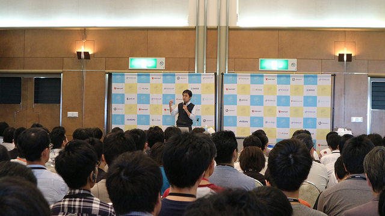
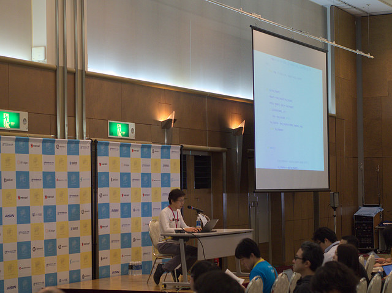

# PyCon JPとは

PyCon JPは、Pythonユーザが集まり、PythonやPythonを使ったソフトウェアについての情報を交換し、Pythonユーザが交流をするためのカンファレンスです。

PyCon JP 2018は2018年9月15日に株式会社HDEで行われたスプリントを皮切りに、9月16日のチュートリアルと9月17日～18日のカンファレンスを大田区産業プラザPiOで行いました。
来場者は4日間で約1156人と大盛況でした。ご参加いただいた皆様、本当にありがとうございました。

ここでは17〜18日に行われたカンファレンスのなかから、選りすぐりの注目セッションやイベントをレポートしていきます。

# 1日目基調講演「Argentina in Python: community, dreams, travels and learning」 ― Manuel Kaufmann

（陶山嶺）

1日目の基調講演は、アルゼンチンから来日されたManuel Kaufmann氏による講演でした。
Kaufmann氏は、Python Argentinaという「車で南米を旅行しPythonを広げる」活動を行っており、2016年2月にPSF Python Ambassadorとして表彰されています。これらの活動からPyCon JP 2018のテーマ「ひろがるPython」にぴったりだということで今回白羽の矢がたちました。
Kaufmann氏は現在、Read the Docsでソフトウェアエンジニアとして働いています。

今回の講演は、Kaufmann氏がどのようにして自分の夢を実現させてきたかというものでした。
在籍していた大学でのPython ArgentinaのイベントでPythonを知り，その文法を好きになったKaufmann氏は`print "Hello world!"`から始めて、メーリングリストで質問をし，素晴らしい回答を得ながらPythonを学んでいきました。

そしてコミュニティから恩恵を受ける中で，恩返しをしたいという気持ちが芽生えはじめ、PyConでトークを行ったり、Djangoに関する書籍の翻訳やアルゼンチン内のさまざまなコミュニティに参加するようになります。

Kaufmann氏は[How To Ask Questions The Smart Way](http://www.catb.org/esr/faqs/smart-questions.html)（日本語訳は[こちら](https://www.ranvis.com/articles/smart-questions.ja.html)）で"いい質問の仕方"が自分を成長させてくれたと実感したようです。
本記事を読んでいるみなさんもぜひリンク先を読んでみてください。

ここからPython Argentinaでの活動の話となっていきます。
Kaufmann氏のいた町は小さな町で、技術系イベントがほとんどありません。
技術系のイベントは大きなところでしか開催されていないからです。
そこで「話を聞きたくても来てもらうことはできないが、自分が行くことならできる」ということに気づきます。
ここから自分の車を使って各地へ赴き、旅行先でPythonのイベントを主催する活動を始めます。
没頭しすぎて彼女に振られる、動物と衝突事故を起こす、食中毒などショックな出来事やアクシデントもたくさんあったようです。
しかし、PSFやコミュニティのメンバー、現地のホスト、一緒に活動をしてくれる人たちからさまざまな支援を受け熱心に活動を続けています。
Kaufmann氏にとっては`print "Hello world!"`が現実のものとなったようです。

発表の中ではさまざまな場所やイベントで撮ったたくさんの写真を見せてくれています。セッション動画もぜひご覧ください。

### 資料リンク

* [動画](https://www.youtube.com/watch?v=KwmF5wyY2C4)

# 招待講演「東大松尾研流 実践的AI人材育成法」 ― 中山 浩太郎

（陶山嶺）

今年の招待講演は、AIの人材育成をテーマに東京大学松尾研究室リサーチディレクターの中山 浩太郎氏にお話していただきました。

中山氏の所属する東京大学工学系研究科 技術経営戦略学専攻 松尾研究室は、5年間で1900人以上の受講者にディープラーニングやデータサイエンスを教えてきたそうです。
その中で、実際にAI人材の育成に携わってきた経験や大事にしていることを、丁寧に伝えていただいたので紹介します。

松尾研究室では、「世の中にいい技術を出していくためには優秀な人材が必要」ということで，基礎研究・社会実装のほかに人材育成にも積極的に取り組んでいるそうです。
松尾研究室流のAI人材育成はWeb工学、データ分析、ディープラーニングの3つを柱とした講座から成り、講座の中心はプログラミングとなっています。
これは「コンピュータサイエンス/ディープラーニングは手を動かさないと習得できない」ことに起因しています。

ここからAI人材に関する講演ということで、ディープラーニングの話へと変わります。

現在のAIブームは実は3回目のブームであり、2006年にHinton氏らが「深い層を持つニューラルネットを実現」したことから始まりました。
そのため、今回のAIブームではディープラーニングが一番重要な要素になっているとのことです。
ディープラーニングの技術は非常に柔軟性、汎用性があるそうで、発表の中では例として翻訳や映像のリアルタイム解析、画像からテキストの生成、テキストから画像の生成などさまざまな用途が紹介されていました。

また、ディープラーニングの世界ではPythonで実装されることが非常に多いのですが、それはNumpyのエコシステムの影響が大きかったからとのことです。

これらのことから、松尾研究室では"Numpy Test System"と呼ばれる自作のシステムで受講生のレベルを合わせ、プログラミング中心、コンペティション、コミュニティを創るの3つの要素を柱としてAI人材を育成しているとのことでした。

### 資料リンク

* [動画](https://www.youtube.com/watch?v=shaG3p8wtlQ)

# 1日目注目セッション「Webアプリケーションの仕組み」 ― Takayuki Shimizukawa

（陶山嶺）

Takayuki Shimizukawa氏による「Webアプリケーションの仕組み」と題されたセッションを紹介します。

最近のWebアプリケーション開発はとても幅広い知識が要求されています。
現在Webサイトに求められる要件はWeb黎明期と比べると複雑、高度化していますが基本的な仕組みは変わっていません。
そのため、黎明期にあったようなWebアプリケーションを作りながらWebサーバーの動作を観察することで仕組みを理解します。

まずは、Webブラウザのデバッグツールやtelnetコマンド、標準ライブラリであるurllib.requestなどを使い、クライアント側から動作を観察する方法が紹介されました。
続いて、Webサーバー側の動作を確認するためにShimizukawa氏が用意した簡易Webサーバープログラムのコード解説が行われました。
簡単な文字列を返すところから始まり、レスポンスをHTMLにする、リクエストによってレスポンスを変える、CSSや画像も返すなどプログラムの変更ととともに挙動が変化することを観察することで非常にわかりやすい解説となっていました。

最後は、改めて現在Webアプリケーションに求められる要件を満たすためにヒントや方法が紹介されました。
PythonではWSGIと呼ばれる仕様があるため、その仕様に沿えば自作アプリケーションであってもGunicornやuWSGIなどを利用して起動できることもライブコーディングで解説されました。

このセッションの[スライド](https://goo.gl/3vBMzZ)は多くのキーワードがリンクになっています。
気になる用語、知らない用語があればぜひリンク先まで参照してみることをおすすめします。

### 資料リンク

* [動画](https://www.youtube.com/watch?v=L7j2zgtpV9c)
* [スライド](https://goo.gl/3vBMzZ)

# 1日目注目セッション「Interpretable Machine Learning, making black box models explainable with Python!」 ― David Low

（大堀優）

Pand.aiのチーフデータサイエンティストであるLow氏は、機械学習の解釈可能性について発表しました。

2018年5月より施行されたEU一般データ保護規則（GDPR）の22条によると、自動化されたシステムによる意思決定の影響を受ける者はその意思決定に対して説明を要求する権利を有するとあります。
したがって、解釈可能なモデルやモデルを説明する技術は、今後機械学習システムを構築する上で重要な要素となります。
Low氏は、モデルに依存しない手法として以下を紹介した後、Floydhub上で作成した犬種の画像認識のデモを用いて各手法を解説しました。

* Partial Dependence Plot (PDP)
* Individual Conditional Expectation (ICE)
* Feature importance
* 代理モデル（LIME）

### 資料リンク

* [動画](https://www.youtube.com/watch?v=DGGpHARTNUE)
* [Interpretable Machine Learning](https://christophm.github.io/interpretable-ml-book)
* [LIME](https://github.com/marcotcr/lime)
* [ELI5](https://github.com/TeamHG-Memex/eli5)

# 1日目注目セッション「How to Data Wrangling? Tips for using python libraries for big-data analysis including scikit-learn.」 ― 松岡光

（大堀優）

不均衡データに関する研究をしている松岡氏は、大規模データ分析におけるscikit-learnのtipsについて発表しました。

scikit-learnに実装されているL2正則化ロジスティック回帰は、デフォルトソルバとして座標降下法（LIBLINEAR）を採用しています。
しかし、L2正則化ロジスティック回帰の目的関数は強凸性を満たすことから、大規模データの場合、SAGやSAGAを用いた方が解の収束が速いことが知られています。
これは、solver='saga'とするだけで簡単に利用できます。

scikit-learnに実装されているSVMは、二次計画問題をSMO（LIBSVM）で解いているため、大規模なデータに不向きです。
そこで、シンガポール国立大学は、”ThunderSVM”と呼ばれるライブラリを開発しました。
このライブラリは、マルチコアCPU上やGPU上で高速に動作する上、scikt-learnライクな形で実装されています。

K-Meansは、クラスタの中心の初期値によって収束速度が大きく変化するため、scikit-learnのデフォルトパラメータの場合、K-Means++で収束しやすい初期値を選出しています。
近年、更に高速に収束する手法としてAFK-MC^2が新たに提案されました。
この手法は、"afkmc2"と呼ばれるライブラリに実装されています。

松岡氏は、これらを全て紹介した後、scikit-learnのデフォルトパラメータと比べて計算時間がどれだけ変化するかを検証しました。

### 資料リンク

* [ThunderSVM](https://github.com/Xtra-Computing/thundersvm)
* [afkmc2](https://github.com/adriangoe/afkmc2)

# 1日目ライトニングトーク

（二宮健）

PyCon JP 2018では，1日目，2日目ともにクロージングでライトニングトークを行いました。1日目は4枠+スポンサー企業の1枠の発表があり、その中から3つピックアップしてご紹介します。

## 「テキストマイニングによるTwitter個人アカウントの性格推定」 ― Jumpei Yoshimura

普段は株式会社アイリッジでサーバーサイドエンジニアとして働いているという吉村さん。

「片思い中のあの人の性格を推定してみよう」として、Pythonの各種ライブラリを使ってツイートの収集や分析を行っていました。
ツイッターで「エゴグラム」の結果をツイートしているアカウントのデータを正解データとして分類していた点が、とてもスマートに感じました。

実際にライブコーディングで実行して「皆さんが絶賛片思い中の[PyCon JP](https://twitter.com/pyconj)のアカウントは『お人好しタイプ』だと分かりました」と言うと会場から拍手が巻き起こっていました。導入時点では正直、「ストーカーの話だけど大丈夫なの？」とスタッフ同士顔を見合わせてる場面もあったのですが、終わってみると真面目でユーモアもある発表だったと思います。

## 「Why your Django account registration should use a Turing test...」 ― Marc-Andre Lemburg

EuroPython SocietyのChairも務めているMarcさんの発表です。

今年の6月に[EuroPython](https://ep2018.europython.eu/)のWEBサイトにサイバー攻撃があり、元々5000人程度ユーザーデータベースに対して、およそ30000人程度の新規登録がされていたそうです。
その時は運良く数日で攻撃がやんだものの、再び攻撃が来たときのために対策したという話でした。

EuroPythonのサイトにはDjangoを利用していて、実際に人間がアクセスしていることを確認するTuring TestとしてTextcha(テキストベースのCaptcha)を導入したそうです。
GDPRの影響でGoogleのCaptchaを使わない判断をしたというのがヨーロッパならではの苦労話で印象的でした。

## 「医学研究者が深層学習環境の立ち上げの際に苦労した話」 ― Satoshi TAKAHASHI

元々は脳外科医だという高橋さん。医学研究というとWet（ピペットやマウスを使って実験を行う分野）を想像しがちですが、2010年頃からDry（情報処理を使う分野）な「大きなデータを持ってきて推論するような分野がメインストリームになってきている」そうです。
しかし、医学研究者のコンピュータサイエンスのリテラシーが必ずしも高くないという問題があるそうです。

そんな周囲の人に頼れない状況で、大量データからの推論のために深層学習環境を立ち上げる際に起こった、「ドライバーやtoolkitのアップデートが早く、公式情報に当たるのが確実だった」「大学の電源が落ちることが合ったのでAPSを導入した」などの苦労話をされていました。

## 1日目ライトニングトーク一覧

今回ご紹介しきれなかったものも含め、1日目のライトニングトークの一覧はこちらです。また、Pythonの公式アカウントに[ライトニングトークの動画](https://www.youtube.com/watch?v=bnC79CvKMbY)がアップロードされています。

* PyCon JPで転職してみた人のホンネ : 平尾元紀(Motoki Hirao)
* テキストマイニングによるTwitter個人アカウントの性格推定 : Jumpei Yoshimura
* Why your Django account registration should use a Turing test... : Marc-Andre Lemburg
* 医学研究者が深層学習環境の立ち上げの際に苦労した話 : Satoshi TAKAHASHI
* 暗号通貨技術・ブロックチェーン技術を活用するCrypto-Fintech Lab. : Narisa Takita

# 次回は

1日目のカンファレンスレポートは以上です。今回紹介できなかったセッションも多数あるのですが、それらは下記のリンクから見ることができます。みなさまの気になるセッションやトークは見つかりましたか？

* [Youtube PyCon JP公式アカウント](https://www.youtube.com/channel/UCxNoKygeZIE1AwZ_NdUCkhQ)

2日目のレポートも後日、公開しますので楽しみにしてください！
