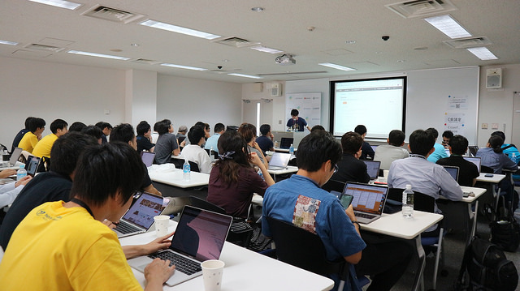
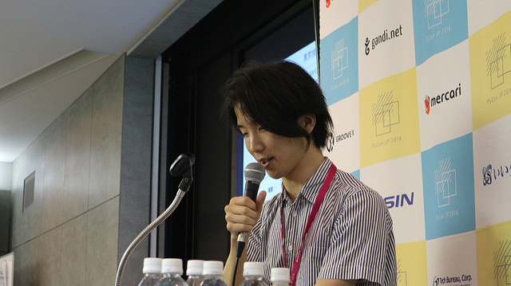

# 基調講演

(ここに書く@nino)

# Djangoアプリケーションにおけるトイル撲滅戦記

(ここに書く@nino)

# C拡張と共に乗り切るPython 2→3移行術

(ここに書く@nino)

# REST API に疲れたあなたへ贈る GraphQL 入門

昨今「GraphQL vs REST」という形で紹介され、Rest APIの次のパラダイムとして注目されている GraphQL 。その特徴と用途、GraphQL やそれを簡単に使うための AWS AppSync の使い方をTsukagoshi Keisuke氏にご紹介いただきました。

詳細はレポートの末尾に資料と動画へのリンクを載せているのでそちらをご確認ください。

満席のセッション

　セッションはGraphQL自体のおさらいから始まりました。GraphQLとは、APIのためのクエリ言語であり、型システムを使って実行するためのサーバー側のランタイムの総称で、「取得（クエリ）」、「変更（ミューテーション）」、「購読（サブスクリプション）」ができるデータ言語です。
　REST APIで課題となる、API仕様の管理や、オーバーフェッチ（余計なデータが取得される）、アンダーフェッチ（1回の問い合わせで十分なデータが揃わず、複数回問い合わせる必要がある）と言われる、1回のオペレーションに複数のAPIのレスポンスが必要になってしまう問題を解決できます。

特徴としては以下の3点が挙げられました。
「型指定されたスキーマ」により、APIの定義をするだけでドキュメントの自動生成やクエリの実行環境がGraphQLサーバーによって提供されます。

「クライアントからのレスポンス形式の指定」ができるので、オーバーフェッチ、アンダーフェッチを回避できます。クライアントは必要なデータを指定することができるので、REST APIよりもクリーンなインターフェースを提供できます。

「購読を利用したリアルタイム処理」を実現できます。チャットアプリのようなリアルタイム性が必要な場合、購読するエンドポイントを指定することで、ポーリングせず簡単にデータをやり取りできます。

Tsukagoshi Keisuke氏が好きなサービスでもあるという、簡単にGraphQLを使い始めることができる「AWS AppSync」について解説とデモがありました。GraphQLサーバーを0から構築することも、用途に合わせて雛形を使って簡単に使い始めることもできるそうです。またGithubでクライアントアプリも提供されているので、クライアントとの動作確認も簡単にできます。クエリの実行環境も提供されており、コードの補完も効くのおで、ストレスなく開発を進めることができるとのことでした。
　データ保存先にはDynamoDB、Erasticsearch、AWS Lambdaが選択でき、AWS Lambdaを指定すれば、業務要件に合わせて柔軟にカスタマイズも可能とのことです。
　AWS IAMまたはOpenID Connectに準拠した認証機能も提供していおり、認証が必要ない場合にも対応可能だそうです。

いかがでしたでしょうか。GraphQL使ったことがない、難しそうと思っている方にとっては、AWS AppSyncで動かしてみるのがよさそうですね。

ここでは紹介しきれなかった内容がたくさんありますので，以下のリンクからぜひご確認ください。

[REST API に疲れたあなたへ贈る GraphQL 入門](https://www.slideshare.net/keisuketsukagoshi/rest-api-graphq) - slidesharel

[06-202_REST API に疲れたあなたへ贈る GraphQL 入門(Tsukagoshi Keisuke)](https://www.youtube.com/watch?v=KVQHPtOef-8)

# Pythonによる異常検知入門

統計的手法から、機械学習やDeep Learningを用いた様々な異常検知アルゴリズムの概要と、Pythonでの利用方法、実際のアプリケーションに組み込む場合の注意点などをご紹介いただきました。

詳細はレポートの末尾に動画へのリンクを載せているのでそちらをご確認ください。

大山匠氏

　異常を検知する前提として、「異常」である状態を定義する必要があります。外れ値やベースラインの変化などは、外的要因（隣の機械の振動、担当者の変更による動かす癖の変化、機械の仕様など）による場合もあります。データだけ見ていても、本当に異常なのか判断できない場合があるというのが、難しいところだそうです。

　異常検知のアルゴリズムについての紹介がありました。異常は頻繁に起こるものではないので、今回は「教師なし学習」で異常を検知していきます。「教師なし学習」で正常な状態を学習させることで、新たに来たデータの外れ具合から異常であることを検知するという手法を用いるそうです。以下の手法のメリット、デメリットを、Pythonでの実装方法ともに紹介いただきました。

- 外れ値検知：ホテリング法、近傍法、LOF(Local Outlier Factor)、One-Class SVM
- 変化点検知：複数予測モデルのあてはめ（予測モデルからの誤差を計算）、累積和法、Change Finder（外れ値検知を多層的に利用）
- 異常部位検知：近傍法（ウィンドウ処理によって外れ値検知の問題として解く）
- ニューラルネットワークを使った異常検知：Autoencoder

　最後に、実際の現場で活用するにあたっての注意点をご紹介いただきました。以下3点がポイントになるそうです。

- 「データの状態」による値の傾向の変化に注意する。
　　電源Offやアイドリング状態が異常として検知されないようにしないといけない。状態の定義は現場の人にヒアリングしながら決める必要があるとのことです。
- 季節性、トレンドなどを除外する、検知アルゴリズムに合わせて分布を変換する（例：Box-Cox変換）など「データのクレンジング」が必要。
- 異常と判定したが、実際はどうだったのかという「判定結果へのフィードバック」を受けて、モデルに反映する仕組みが必要。

いかがでしたでしょうか。工場機械での異常検知のお話でしたが、Webシステム等でも応用できる考え方だと思います。
ここでは紹介しきれなかった詳細は，以下のリンクからぜひご確認ください。

[03-204_Pythonによる異常検知入門(大山匠)](https://www.youtube.com/watch?v=es_3W6H4oSI)

# 2日目ライトニングトーク

1日目と同様に2日目のクロージングでもライトニングトークがありました。
ここではその中から2つのライトニングトークを紹介します。

## 「diff 最小化原理で導く Zen of Python」 ― 多田吉克

「diff 最小化原理で導く Zen of Python」というタイトルで発表してくれたのは株式会社いい生活の多田 吉克さんです。
Python歴が2年目と若い多田さんですが「2年目なりにPythonを書くときにどうしたらいいか考えてきました」とのことです。
「修正コスト = diffの量」と捉え「将来のdiffが最小化されたコードがいいコードではないか？」という仮説を持ったそうです。
そのためにできることとして具体的に下記のTipsを挙げていました。

* 複数モジュールのimport文やリスト、辞書などで行末にカンマを書く
* 早期リターン
* （アクセス制御などでは）デコレータを使う

みなさんもコードを書く際の指針の1つとしてdiffを意識してみるといいかもしれませんね。

## 「システム開発素人が深層学習を用いた画像認識で麻雀点数計算するLINEbotを作ったハナシ」― 栗原理央

麻雀、Pythonが好きな栗原理央さんは深層学習を使っている株式会社ブレインパッドのデータサイエンティストです。
ご自身が作った麻雀点数計算チャットボットについてライトニングトークをしてくれました。
もともとのスキルからか麻雀点数計算部分は比較的簡単に作ることができたようですが、Flaskとherokuを使ってLINEbotにするところで下記のような点で苦労したようです。

* アプリ立ち上げに60秒かかるとdynoコンテナが再起動される
* 100MB以上のファイルを置けない（深層学習モデルはこれより大きい）
* LINEにReplyできるのはユーザーアクションから30秒以内に1度だけ（モデルのロード/ビルド、推論はもっとかかる）
* メモリが512MBを超えると処理が遅くなる

いずれもHeroku、LINE Messaging APIのフリープランゆえの制約のようです。
この制約を越えるために行った工夫はぜひ動画でご覧いただければと思います。

## 2日目ライトニングトーク一覧

今回ご紹介しきれなかったものも含め、2日目のライトニングトークの一覧はこちらです。また、Pythonの公式アカウントに[ライトニングトークの動画](https://www.youtube.com/watch?v=363E_nzKe7Q)がアップロードされています。

* 暗号通貨技術・ブロックチェーン技術を活用するCrypto-Fintech Lab. : Narisa Takita
* 安全なサンドボックス構築の裏側 ~投資アルゴリズム構築環境QuantX Factoryの事例~ : 康裕三
* diff 最小化原理で導く Zen of Python : 多田吉克
* Python × Investment ~投資信託をPythonで分析して、その結果を公開するサービス作った話~ : Takahiro Kato
* システム開発素人が深層学習を用いた画像認識で麻雀点数計算するLINEbotを作ったハナシ : 栗原理央
* 【poke2vec】ポケモンの役割ベクトルの学習とその分析・可視化 : 喜多智也
* asyncio + aiohttp で作るウェブサービス : Pine Mizune
* PyCon JP 傾向と対策 : ryo kato

# クロージング

ライトニングトークのあとはPyCon JP 2018全体のクロージングでした。
4日間に渡るPyCon JP 2018全体の参加者数は1156人とPyCon JPとして初めて1000人を超す規模のイベントとなりました。
また今年のクロージングではサプライズとして来年のPyCon JPの日程も発表されました。
来年のPyCon JP 2019は2019年9月に今年と同じく大田区産業プラザPiOで開催されます。
来年もぜひ参加してみてください！

