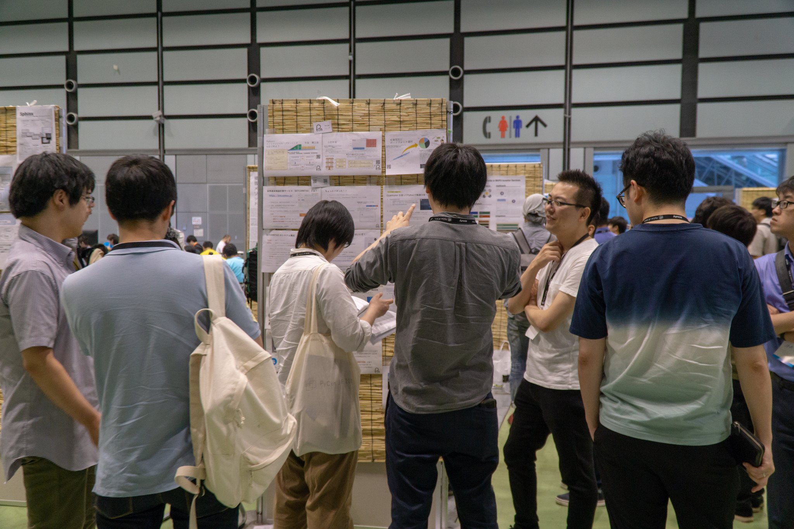
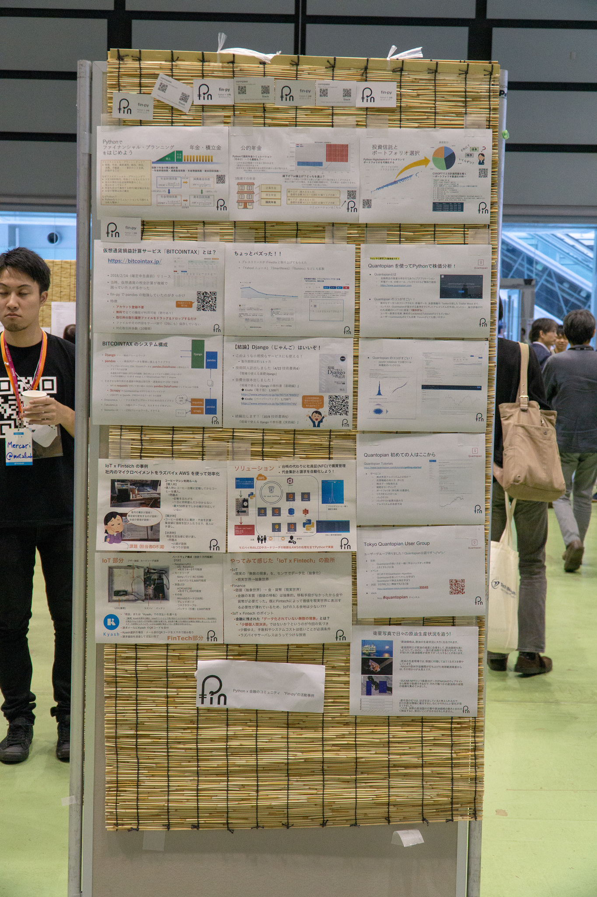

## Python x 金融のコミュニティ fin-pyの活動事例

最後は今年のPyCon JPでトークセッションも行っていたdrillerさんです。
ポスターセッションの内容はご自身で立ち上げたfin-pyというコミュニティの活動事例でした。

-- それでは自己紹介をお願いします。

はい。driller(どりらー)と申します。個人投資家で一人社長で会社もやっています。
最近はPythonとかPandasでデータサイエンティスト養成講座の講師業もやっています。

-- Python暦ってどれくらいですか？

3年くらいですね。Pythonに興味を持ってPyCon JP 2015に初めて参加して、以降毎年参加しています。
もともと投資家になる前はインフラ周りをしていて、プログラミング経験なしで投資家になってからプログラミングを始めました。
仕事でPythonを使うなんて夢にも思っていませんでした（笑）

-- ありがとうございます。今回ポスターセッションでも紹介されているfin-pyというコミュニティについても教えてください。

PyCon JP 2016で金融系のトークをしたんですよ。
その時オープンスペースという企画があったので金融に興味をある人を集めたら思いの外集まったので「じゃぁコミュニティ作ろうか」という感じで始めました。
PyCon がなかったらfin-pyはなかったです（笑）

-- fin-pyはご自身で作られたコミュニティだったんですね。活動内容も教えていただけますか。

活動内容は月に一回もくもく会をしています。
あとはたまにトークイベントをやっています。
例えば年金をPythonで最適化する話とか税理士さんに来ていただいて仮想通貨の税金の話をしていただいたりしました。
道具としてPythonを使っていますが、金融とテクノロジーで面白いものを作れればなと思っています。

-- なるほど。それでは今回のポスターセッションの発表内容を教えてください。

「fin-pyって何なの？」「金融って難しそう」みたいなイメージを持たれてると思うので、そういったハードルを下げるために活動事例を紹介しています。
事例はfin-pyの活動の中で面白そうなことをやっていた5名の方に「こういうことやってましたよね」ってもくもく会の中でお願いしました。

-- それぞれの事例を軽く紹介していただくことってできますか。

はい。大丈夫です。
まず「Pythonでファイナンシャル・プランニング」は年金、保険などの個人のファイナンシャルプランをPythonでいい感じにやってみるというものです。
ファイナンシャルプランって文系のイメージがありますが、XXに何%投資するかは自分で決めないといけないので、そこは理系やテクノロジーの領域なんですよ。

その下の「仮想通貨損益計算サービス「BITCOINTAX」とは？」は仮想通貨を取り扱っている各社からダウンロードした取引履歴などをアップロードするだけで損益計算してくれるWebアプリを作ったという話です。
会社によって損益シートなどのAPIがバラバラで個人が確定申告するときにすごく大変なのでその負担を減らすためのものですね。
技術書典でDjangoの本を出しているakiyokoさんがDjangoで作っていました。

「社内のマイクロペイメントをラズパイxAWSを使って効率化」は社内のコーヒーマシンを使うときに社員証でピッてするだけで購買履歴を管理できるようにしたという事例です。
それまでは台帳に記入して現金決済していたので誰がどれくらい飲んだかを集計するのが大変だったらしく、「これなんとかしようぜ」ってラズベリーパイとAWSを組み合わせて作っていました。
マイクロペイメントっていう小規模の決済なのでこれも金融の一部ですが、金融の知識がなくても作れるし楽しめると思います。

-- すごく身近に感じられますね。fin-pyでもハード使ってる方いたとは。。。（笑）

あまりいないんですが、いつもfin-pyで場所を借りてる会社さんだったのでそこのハードルが低かったんです（笑）

「Quantopianを使ってPythonで株価分析！」はQuantopianという米国株式の過去株価データを使って検証するプラットフォームの紹介です。
アルゴリズム（ルール）を書くとそれに沿って、過去のデータからするとどれくらいの損益を期待できるか見積もってくれるんですが、内部でPythonが動くので自分でコード書けるんですね。
ただ、全部英語のプラットフォームでドキュメント読むの大変なのですが、ユーザーグループも紹介してるのでそこの勉強会で初めての人でも一緒にやれますよっていうことを伝えたいです。
金融が得意な人とPythonが得意な人がお互いに教えあえる会になっています。

最後は「衛星写真で日々の原油生産状況を追う！」ですね。
原油は産出量が決まっているので、それによって原油価格が大きく影響されるんです。
ただ、本当に減産してるのか、本当に増産してるのかっていうのはわからないので、衛星写真を使って本当に採掘してるの？っていうのを研究した事例になります。
原油を採掘しているときは燃えてるのでそこが明るくなるんですね。そこで実際の採掘状況を追ってる方がいたので面白いなと思って紹介していただきました。
結果が気になる方はfin-pyに来ていただければ（笑）

-- 今回なぜトークセッションではなくポスターセッションを選んだのでしょうか。

今回は１つのテーマに絞るよりも、多様性やハードルの低さをアピールしたかったからですね。
一人でやるトークよりもいろんな人のやった活動を集めてできるほうがあってるなぁと思いました。
あと、金融関係のトークは免責事項の注意が多いのでけっこう大変で、言えないことが多いのでつまらなくなるんですね。
ポスターセッションだと実際に来てくれた人に雑談ベースで話しやすいということもあります。

-- ポスターセッションはコミュニティとして参加している方も多いですね。今回コミュニティとして出す作業分担など難しいところはありましたか。

fin-pyはもくもく会の最後にやったことを発表しているんですね。
なので、発表に活かせるネタはそれなりにありました。
それでも事例を紹介してくれた方々は資料を集めたりするのは大変だったと思います（笑）
あとは狭いスペースにどうやっておさめるかとかは工夫しましたね。
ただ、一人ではなかなかできないことをみんなでできたのでメリットのほうが多かったと思います。

-- コミュニティとして発表する場合にはポスターセッションはすごくマッチしてそうですね。drillerさん、ありがとうございました！

## 最後に

いかがでしたでしょうか。
ポスターセッションで実際に発表された方々の話を聞くと、ポスターセッションはトークセッションより応募のハードルが低く、多くの人にリーチできるようです。
また、興味を持ってくれた人と直接話ができるためより深い内容を共有、議論することもできます。
ひとりだけでがんばるのではなく、複数人で協力して発表できるコンテンツでもあるので、来年はぜひ周りの人を巻き込みながらポスターセッションにも応募してみてください。
