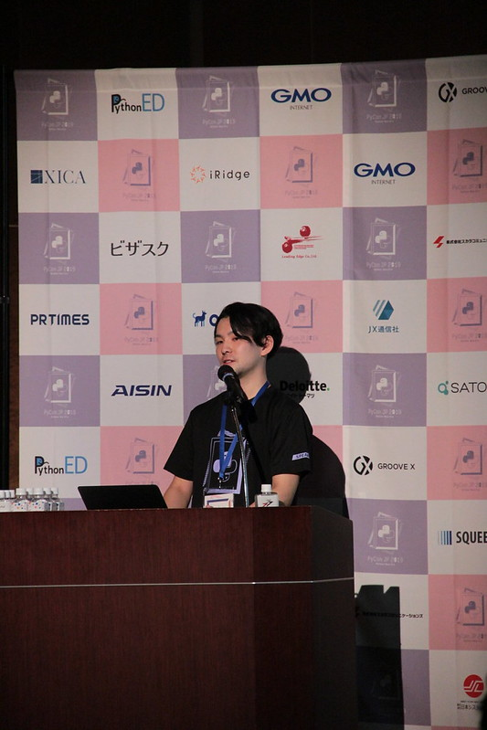

先日公開したPyCon JP 2019 1日目のカンファレンスレポートはいかがでしたでしょうか？ 本レポートでは引き続き、2日目の基調講演やカンファレンスなどの様子をご紹介します。

PyCon JPは、Pythonユーザが集まり、PythonやPythonを使ったソフトウェアについての情報を交換し、Pythonユーザが交流をするためのカンファレンスです。PyCon JP 2019は2019年9月14日にHENNGE株式会社で行われたスプリントから始まり、9月15日チュートリアルと9月16日〜17日のカンファレンスを大田区産業プラザPiOで行いました。

今年のテーマの「Python New Era」には日本の元号が平成から令和に変わり、Pythonも2から3へ新しく時代が移っていくコンセプトが込められています。今年も素晴らしいセッションが多数発表されましたので、その中からピックアップして紹介します。各講演・セッションの紹介の最後に、動画やスライドのリンクも紹介してあるので、当日参加した方もできなかった方も、気になったものをさらにチェックしてみてください。

# 2日目基調講演

@nikkie


### 資料リンク

* [動画]()
* [スライド]()

# トークセッション（1）

@nikkie


### 資料リンク

* [動画]()
* [スライド]()

# Pythonでライブをしよう -FoxDotを使った新時代のPython活用法- - 田中 慎太郎

(横山直敬)

株式会社日本システム技研所属の田中 慎太郎氏による発表です。

FoxDotとは、音響合成用プログラミング環境・言語のSuperColliderをPythonから操作するためのライブラリです。
SuperColliderを用いるとリアルタイムに音響を合成することができます。SuperCollider自体は独自のプログラミング言語ですが、
FoxDotによりインタラクティブシェルやJupyter NotebookからPythonの文法でSuperColliderの機能を使うことができます。



音楽や映像をインタラクティブに生成するパフォーマンスを「ライブコーディング」と呼びます。「ライブコーディング」の特徴は偶然性と即興性のあるアルゴリズミックなアプローチができることです。
田中氏はDTMを趣味にしており「ライブコーディング」の存在自体は知っていましたが、当初はプログラミングする必要性に疑問を持っていたそうです。しかし「[そのDJたちは「コード」で踊らせる──人間と機械が“共創”するアルゴレイヴの世界](https://wired.jp/2019/05/19/algoraves-live-coding-djs/)」という記事に触発されてライブコーディングを始めました。

FoxDotで使える音色は大きく分けて3種類です。

1. play: ドラム音源。文字ごとに別々の音源が割り当てられている

2. loop: 自前で用意した音声ファイルのループ。

3. それ以外: シンセサイザーのような音

FoxDotではPlayerObjectと呼ばれるオブジェクトで音色とその設定であるSynthDefsを操作します。SynthDefsでは属性を編集することで音色や音高、長さを変更できます。
SynthDefsの中では繰り返し表現をしたり時間による変化をつけることができます。
繰り返し表現はPatternObjectを使い、listの先頭にPをつけて表します。PatternObjectを使うことで冗長なコードを避けることができます。
時間による変化はTimeDependentVariablesを使います。実行ごとに結果を変えることができます。


以下に示すのがFoxDotのコード例です。普段、目にしているPythonの文法とは大きく異なっています。PlayerObjectへのSynthDefsの割り当てにはシフト演算子が使われていますし、PatternObjectはlistが元になっています。
この通常のPythonと異なる振る舞いはPythonのオブジェクトが持つ特殊メソッドを使って、元の振る舞いを上書きすることが実現していると説明していました。

```python
d1 >> play("X-O-")
p1 >> pluck([0, 1, 2, 3, 4, 3, 2, 1], dur=1/2, amp=1.5) 
p2 >> pluck(P[[0, 1, 2, 3, 4])
```

Pythonは主にWeb開発やデータ分析で活躍していますが、これからはそこにライブコーディングも加わっていきそうです。
トークセッションでは実際に田中氏がFoxDotを使ったライブコーディングを行う一幕もありました。実際にどのようなパフォーマンスができるのか気になる方はぜひ動画もチェックしてみてください。

### 資料リンク

* [動画](https://www.youtube.com/watch?v=lCQWLAJf6xQ)
* [スライド](https://speakerdeck.com/sin_tanaka_21/pyconjp-2019)

# トークセッション（3）

@HiraoMotoki


### 資料リンク

* [動画]()
* [スライド]()


# トークセッション（4）

@HiraoMotoki


### 資料リンク

* [動画]()
* [スライド]()

# 2日目ライトニングトーク

説明 @ksugahara

## 1つ目タイトル

@nikkie


## 2つ目タイトル

@nao_y


## 2日目ライトニングトーク一覧

@nikkie

今回ご紹介しきれなかったものも含め、2日目のライトニングトークの一覧はこちらです。また、Pythonの公式アカウントに[ライトニングトークの動画]()がアップロードされています。

# クロージング

@HiraoMotoki
